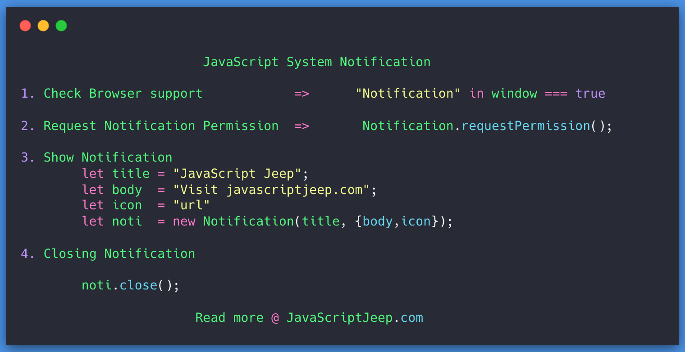

Using Notification API you can display a notification on your website.

Three simple steps to show system notification

* Check if the browser supports Notification

* Ask the user for permission to show the notification.

* Once user grant permission, create a Notification object

* Show the notification with your custom message

## Check Browser support

```js
typeof Notification !== "undefined"
```

## Ask user Permission

Before asking permission, let’s check if the permission is already granted. To get the notification permission, you can use

```js
Notification.permission
```

It can have `3` values

`denied` → Permission granted

`granted` → Permission granted

`default` →The user choice is unknown and therefore the browser will act as if the value were denied.

Consider that the Notification.permission is default . Now you need to ask permission from the user to show a notification.

The requestPermission method in Notification is used to raise a request to user. This will return a promise , which resolves to one of three permission

```js
Notification.requestPermission().then(function (permission) {

    console.log(permission);

});
```

## Displaying Notification

To display a notification, we need two things

* Title → Title to display within the notification

* Message → Body text of the notification, which is displayed below the title.

Optionally we can include

* icon → URL of an icon to be displayed in the notification.

The above options are the most commonly used, you can see the full list [here]
(https://developer.mozilla.org/en-US/docs/Web/API/Notification/Notification).

```js
var title = "JavaScript Jeep";

icon = '[https://homepages.cae.wisc.edu/~ece533/images/airplane.png](https://homepages.cae.wisc.edu/~ece533/images/airplane.png)';

var body = "It's Your boarding time";

var notification = new Notification(title, { body, icon });
```

Display the notification only if the user is not in the current tab. To check if the current tab you can user document.visibilityState .

If the visiblityState != visible then show the notification

```js
let showNotification = document.visibilityState !== "visible";

if(showNotification) {
   // Notification code
}
```

Closing the Notification

If the user comes back to the browser tab which triggers the notification, you need to close the notification using close

```js
var notification = new Notification('Travel');

notification.close();
```

## Events on Notification

`click` → user clicks on the notification.

`close` → Notification is closed.

`error` → The notification couldn't be displayed for some reason.

`show` → Notification is displayed to the user.

## Focus Tab on clicking the notification.

You can change the current tab to the tab which displays notification by using window.parent.focus()

```js
var notification = new Notification('Travel');

notification.onclick = function(){
                         window.parent.focus();
                         notification.close();
                        }
```

## Putting it all together

```js
let permission = Notification.permission;

if(permission === "granted"){

   showNotification();

} else if(permission === "default"){

   requestAndShowPermission();

} else {

  alert("Use normal alert");

}

```

Request Notification from user
```js
function requestAndShowPermission() {
    Notification.requestPermission(function (permission) {
        if (permission === "granted") {
            showNotification();
        }
    });
}
```

And finally Show Notification

```js
function showNotification() {

   if(document.visibilityState === "visible) {
       return;
   }

   var title = "JavaScript Jeep";

   icon = "image-url"

   var body = "Message to be displayed";

   var notification = new Notification('Title', { body, icon });

   notification.onclick = () => {
          notification.close();
          window.parent.focus();
   }

}
```

Project Idea.

* To do list → Show to-do list notification

* Pomodoro clock → Show time up notification.
