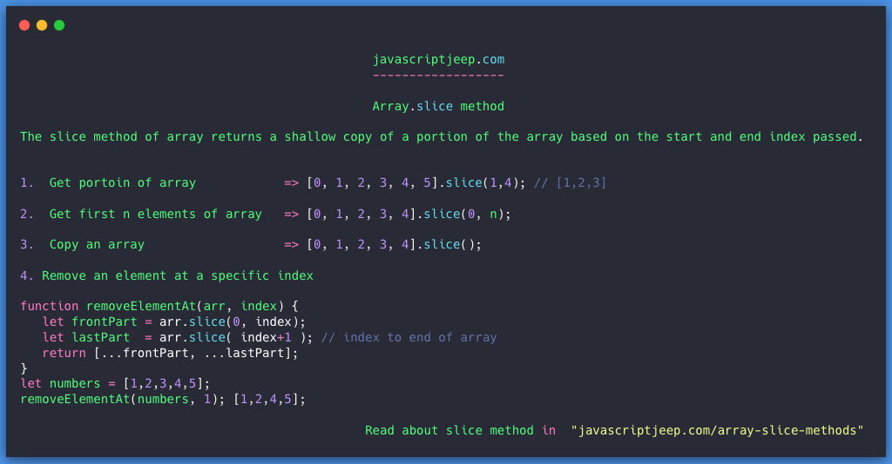

## Slice

The slice method of array returns a shallow copy of a portion of the array based on the start and end index passed.

Points to remember

* Both start and end is an optional argument

* By default the start is 0 and end is array.length

* end is index is not considered, means if you slice an array passing start as 0 and end as 5 then, elements from 0th to 4th index will be copied

* The slice doesn’t affect the source array from which we are performing slice.

* It only creates a shallow copy.

* We can also give negative value for start and end index, which indicates an offset from the end of the array. -1 point to last element, …

```js
var numbers = [0, 1, 2, 3, 4, 5];

var newNumbers = numbers.slice(1,4);

newNumbers;   //[1,2,3]
```

## 1. Copy Array

```js
var numbers = [0, 1, 2, 3, 4, 5];

var copiedNumbers = numbers.slice(0, numbers.length);

copiedNumbers; // [0, 1, 2, 3, 4, 5]
```

By default, the start index is 0, and end index is length of the array. By applying that

```js
var numbers = [0, 1, 2, 3, 4, 5];

var copiedNumbers = numbers.slice();

copiedNumbers; // [0, 1, 2, 3, 4, 5]
```

## 2.Getting first N Array

It is similar to copying array instead of passing end index value as arrayLength , pass end index as n

```js
function firstNItems(n, numbers =[] ) {

   if(n >= 0) {
      return numbers.slice(0, n);
   }

   return [];

}

firstNItems(0, [1,2,3]); // []

firstNItems(2, [1,2,3]); // [1,2]
```

## 3. Remove an element at a specific index

Using shift and pop method, you can remove element at the front and end of the array respectively. But there is no method to remove an element at specific index for that you can use slice method.

Here you will

* create an array which contains all elements of array before the index

* create an array which contains all elements of array after the index

* join two array

```js
function removeElementAt(arr, index) {

   let frontPart = arr.slice(0, index);

   let lastPart  = arr.slice( index+1 ); // index to end of array

   return [...frontPart, ...lastPart];

}

let numbers = [1,2,3,4,5];

removeElementAt(numbers, 1); [1,2,4,5];
```

Please donate [here](https://www.paypal.me/jagathishSaravanan?locale.x=en_GB)
